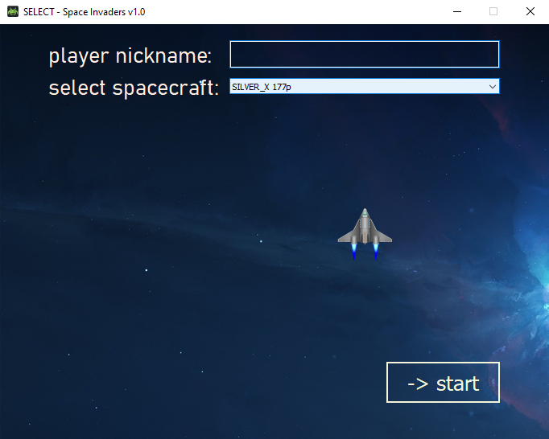
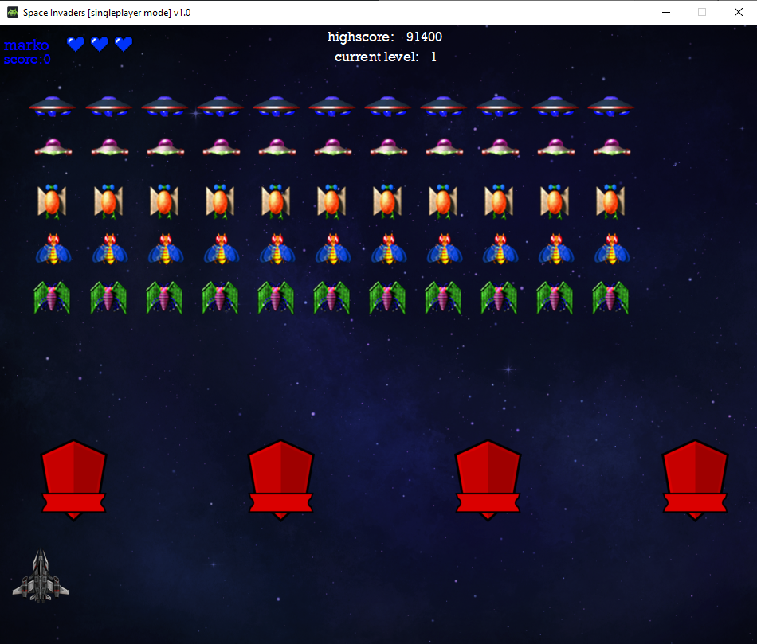

# Space Invaders (1978) 

Rekreacija igre Space Invaders iz 1978. godine sa modernim dizajnom.  
Igra je realizovana uz pomoc PyQt5 biblioteke u python programskom jeziku.  
Cilj igre je pobediti sve vanzemaljce.  

## Neophodne tehnologije 
- [PyQt5](https://pypi.org/project/PyQt5/)  
- [Python3](https://www.python.org/downloads/)  
- [PyCharm](https://www.jetbrains.com/pycharm/download)  

## Uputstvo za korisćenje  

### Meni  
Prilikom pokretanja aplikacije, prikazuje se početni meni.  

  

Postoji nekoliko režima igranja:  
- Singleplayer  
- Multiplayer  
- Turnir  

Svaki od ovih režima biće objašnjen u posebnim sekcijama.  

### Singleplayer  

Singleplayer je mod igrice u kojem učestvuje jedan igrač.  
Klikom na `start game`, odabira se ovaj mod. 

  
  
 Nakon klika, korisniku se otvara prozor u kom treba da unese svoj nickname  
 i nudi mu se izbor raznih svemirskih brodova.  
 Polja su validirana, tj. korisnik ne može da nastavi dalje bez unetog imena.  
 
 Pritiskom na `-> start`, igra započinje.  
 
   
 
 
 ### Ciklus igre   
 
 
 ### Pravila igre  
 
 
 ### Komande  
 
 
 ### Opis realizacije

